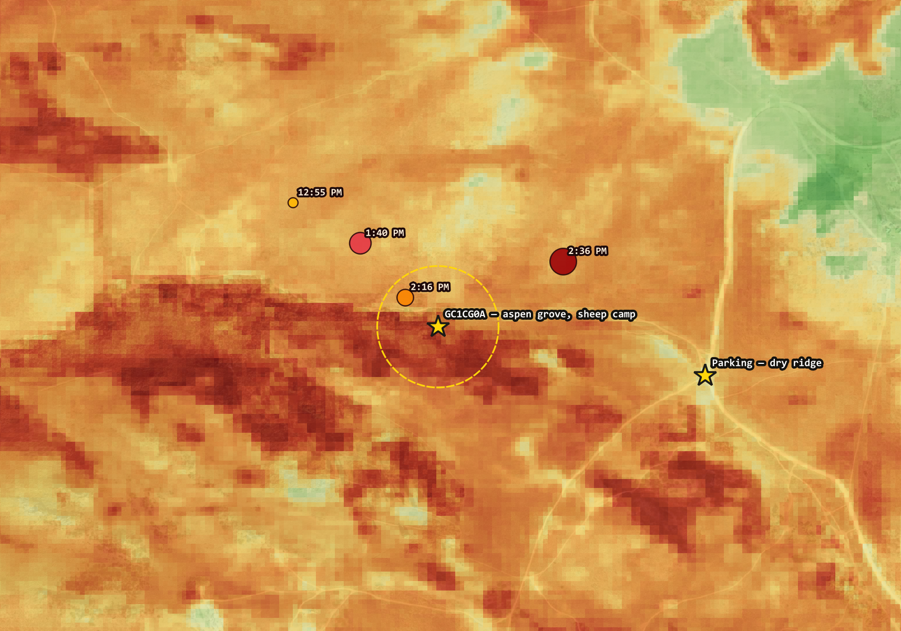
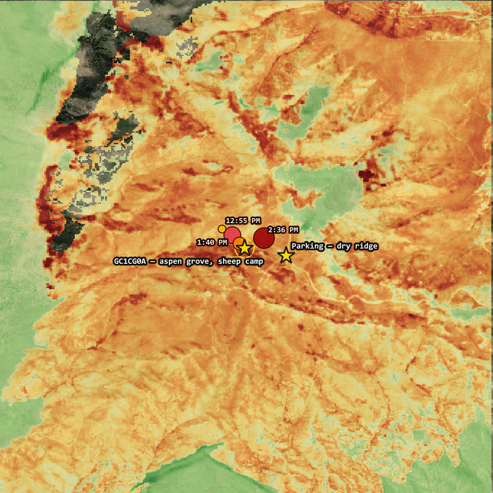
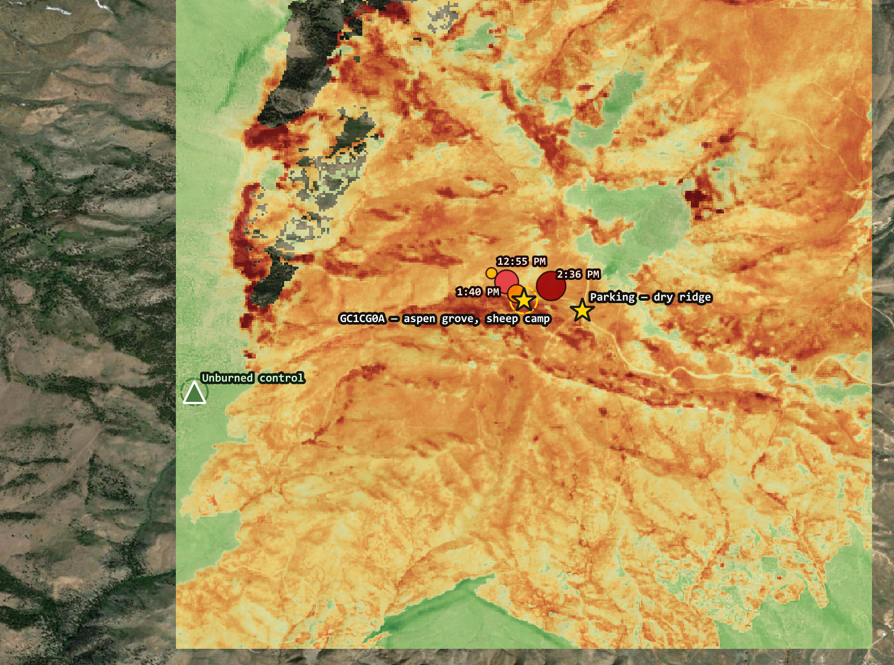

# 🔥 peavine-watch

**What did the fire actually do to a mountain, a spring, and a hundred years of
carved names — and can you find out from a couch 800 miles away, for free?**

On 22 August 2026 at 11:23 AM, someone started a fire five miles north of Reno,
Nevada. Ninety-two minutes later a satellite in low Earth orbit saw it burning
315 metres from a small yellow star on the map below.

That star is geocache **GC1CG0A**, hidden in 2008 at an old Basque sheep camp: a
meadow fed by a mountain spring, under aspen trees carved with a century of
names. I placed it. The description I wrote then says *plan to spend some time
checking out all the tree carvings — it's like a time capsule in the mountains.*

This repo is what happened next, using nothing but public satellites and open
compute.

**Live dashboard → [bdgroves.github.io/peavine-watch](https://bdgroves.github.io/peavine-watch/)**
— updated every time Sentinel-2 passes over.

| | |
|---|---|
| 📊 **Live dashboard** | [bdgroves.github.io/peavine-watch](https://bdgroves.github.io/peavine-watch/) |
| 📝 **The write-up** | [Watching a Mountain Burn](https://brooksgroves.com/blog/watching-a-mountain-burn.html) — what the analysis found, and where I got it wrong first |
| 🚵 **The same mountain, 30 years earlier** | [The Mountain You See Every Day](https://memoir.brooksgroves.com/paragon-peavine.html) — riding Peavine out of downtown Reno in the 1990s, and the grove before any of this |
| 📍 **The cache** | [GC1CG0A · Basque Sheepherder: The High Camp](https://www.geocaching.com/geocache/GC1CG0A_basque-sheepherder-the-high-camp) |

> The Hawk Fire destroyed 32 homes, damaged six more and injured seven people, three of
> them responders. At its peak 42,000 residents were under mandatory evacuation. This
> repository is about one hillside within that fire. It is not the important part of it.

---

## Why there was anything there to burn

A GRASS `r.watershed` run over USGS 3DEP elevation puts the cache almost exactly
on a drainage line.

| | |
|---|---|
| Coordinates | 39.58475 N, −119.94228 W |
| Elevation | 2,309 m / 7,574 ft |
| Aspect / slope | SE-facing, 13.3° |
| Flow accumulation | **214 cells** — a real drainage |
| Distance to mapped channel | **31 m** |
| Cache placed | 2008-05-21 · ammo can · 63 finds |

A parking waypoint 500 m away scores a flow accumulation of **1** — flat, dry
ridge. That contrast is the whole geography of the site in two numbers. Water
finds this exact spot on the mountain, and has for a very long time.

The spring is why the grove is there. The grove is why the sheepherders camped
there. The camping is why the carvings are there. Remember that chain — it comes
back at the end, and it isn't kind.

---

## The fire, minute by minute

VIIRS is a thermal sensor on two polar-orbiting satellites, passing over any
given point roughly twice a day. It doesn't usually let you watch a fire arrive
at a specific coordinate — but Hawk moved fast enough, and the passes lined up
well enough, that here it basically does.

| Time (PDT) | Distance from cache | What VIIRS saw |
|---|---|---|
| 11:23 AM | — | Ignition |
| 12:55 PM | 315 m | First detection, 92 min after ignition |
| 1:40 PM | 222 m | High confidence, 216 MW |
| **2:16 PM** | **79 m** | High confidence, 142.7 MW |
| 2:36 PM | 282 m | 230 MW |

Ninety minutes to close 236 metres. Fire radiative power in that range is an
active flaming front, not a smoulder, and brightness temperature **saturated the
sensor's ceiling (367 K)** on most of these — VIIRS simply could not register
anything hotter. By the next morning the fire had run 6.6 km and covered over
15,000 acres.



*Burn severity around the site with the VIIRS detections walking up the drainage,
sized by fire radiative power. Gold star is the cache; dashed ring is the 150 m
sampling radius.*

---

## What burned, and how we know

Two standard burn indices from **Sentinel-2**, ESA's free 10-metre satellite,
using before-and-after scenes of the exact same ground.

**NBR** contrasts near-infrared against shortwave-infrared. Healthy leaves are
bright in NIR and dark in SWIR — high NBR. Fire strips that away and exposes bare
soil and char, which flips it. Taking the change (`dNBR = NBR_before − NBR_after`)
isolates what the fire *did* from what was simply there to begin with.

**RdNBR** goes further and normalises for that starting baseline
(Miller & Thode, 2007) — the direct fix for a grove-versus-sagebrush comparison.

```
NBR pre-fire   +0.526   (Aug 18, 4 days before ignition, 0.9% cloud)
NBR post-fire  -0.035   (Aug 30, after containment, 0.0% cloud)
dNBR           +0.562   ->  Moderate-high severity
RdNBR          +774.5   ->  in the range most published studies call high
```

Both scenes are the same MGRS tile (11SKD), twelve days apart, with no
reprojection between them. The 150 m ring around the cache came back
**676 of 676 pixels valid** — mean dNBR **+0.655**, median +0.621,
range +0.337 to +1.069.

*(Superseded an earlier provisional run of +0.536 that used an Aug 23
post-fire scene taken while the fire was still burning at 0% containment.
See Limits for what changed and why.)*

At the cache pixel, **NDVI fell from 0.776 to 0.217**. That is closed, healthy
canopy going to bare soil with scattered debris. This was not a surface fire that
ran underneath and scorched some trunks. The crown went.



*43.9% of this area reached moderate-high severity or above. The grove mean of
+0.671 exceeds **91.3%** of the surrounding 3 km. It wasn't caught in a generally
severe fire — it was one of the hottest spots in it.*

---

## Terrain, or just more fuel?

Same fire, same afternoon, 500 metres apart:

| | flow accumulation | NBR pre-fire | dNBR |
|---|---|---|---|
| **Grove / drainage** | 214 cells | +0.526 | **+0.562** |
| Ridge / parking | 1 cell | +0.097 | +0.118 |

Nearly five times the severity. Tempting to call that terrain — fire runs uphill, a
drainage concentrates the front — but **it cannot be read that way as it stands**,
because the two points did not start equal. The grove was dense aspen; the ridge
was sparse sagebrush. Denser vegetation burns hotter more or less everywhere,
because it has more to lose. Part of that gap is fuel load, not terrain.

So hold fuel constant. Compare the grove only against ground that was *equally
vegetated* before the fire:

```
Ground with pre-fire NBR 0.40-0.55:
  grove ring          n=  147    mean dNBR  +0.876
  elsewhere in AOI    n= 7,286   mean dNBR  +0.471
                      terrain-attributable  +0.405
```

The grove still burned harder than **72.3% of equally-fuelled ground**. That
residual cannot be fuel load — fuel load is what was controlled for. What is left
is terrain and moisture regime.

Both effects are real and they compound. Across the whole AOI, severity climbs
steadily with pre-fire density (+0.344 on the sparsest ground, +0.657 on the
densest). The grove sat at the intersection: the heaviest fuel on the hillside,
standing in the feature that concentrated the fire into it.

Which closes the chain from the top of this page, and closes it badly:

> Water collects in that drainage. Water grew the aspens. The aspens were the
> heaviest fuel on the hill, standing in the feature that funnelled the fire to
> them. **Every reason the grove existed is a reason it burned.**

*On the word "chimney":* the slope is 13.3°, which is moderate. A textbook
chimney is a steep narrow gully with a strong convective draft. This is a broad
SE-facing drainage near a summit — fire running upslope with a drainage
concentrating the front. Directionally right; don't overstate it.

    pixi run terrain

---

## Watching what happens next

`pixi run watch` records one row per Sentinel-2 pass into `out/timeseries.json` —
NBR, NDVI and NDSI at the cache pixel, averaged over the grove, and averaged over
an **unburned control stand**, plus dNBR and RdNBR against a **pinned** pre-fire
baseline. Idempotent, so a daily GitHub Actions job polls a ~5-day revisit without
duplicating anything, and the baseline never drifts.

### The control stand

Vegetation senesces every autumn and greens up every spring whether or not it
burned. Without a reference, an October decline at the grove cannot be told apart
from continued fire-driven decline, and next May's green-up cannot be told apart
from ordinary phenology.

So every pass also samples a patch the fire missed, three kilometres WSW:

| | Burned grove | Unburned control |
|---|---|---|
| Coordinates | 39.58475 N, −119.94228 W | 39.57551 N, −119.97543 W |
| Pixels in 150 m ring | 697 | 700 |
| Mean dNBR | +0.671 | **+0.001** |
| Pixels burned | 100% | **0%** |
| NDVI, 23 Aug 2026 | 0.090 | 0.548 |
| NDVI, 31 Aug 2026 | 0.150 | 0.584 |

Chosen from the rasters rather than by eye: pre-fire density in the grove's band,
dNBR < 0.08, 600–4000 m away, and in the densest cluster of 1,683 qualifying
pixels rather than one lucky pixel. It reads slightly denser than the grove ring
on average, so it is used for *change over time*, not absolute comparison.



*Gold star: the burned grove. Green triangle: the unburned control, well outside
the burn perimeter. Dashed rings are the 150 m sampling radii.*

**The headline number is now the difference.** On 23 August the grove read NDVI
0.090 against the control's 0.548 — a gap of **−0.458**. Recovery is not "does
NDVI go up", because spring answers that regardless. Recovery is whether that gap
closes toward zero.

By 31 August the grove read 0.150 and the gap had narrowed to **−0.434**. Both
tiles agree independently on both dates, so it is not noise. It is also almost
certainly **not regrowth** — nothing vegetative happens on burned aspen in the
first week of September. The likelier reading is that the 23 August scene was
taken through smoke and fresh ash, which suppresses NDVI beyond the actual
damage, and that the number is now settling toward the true post-fire floor.

Which is the same reason the severity figure moved. Watch the gap, not the
grove.

### The recovery curve is not the good news it looks like

NDVI responds to chlorophyll directly, so it is the index that moves first when
aspen resprouts. But a strong recovery curve is **not** evidence the carvings
survived — it is closer to the opposite.

Aspen suckering is suppressed by auxin flowing down from the living parent stem.
Kill the stem and that suppression lifts, which is exactly why aspen regenerates
so aggressively after fire. **Vigorous regrowth is caused by the death of the
overstory.** The healthier the green-up looks, the more confident you can be that
the carved trunks are dead.

| Grove NDVI, summer 2027 | What it means |
|---|---|
| climbs to 0.3–0.5 | vigorous suckering — root system alive, carved stems dead |
| stays near 0.1–0.15 | roots died too — rarer, and the worse outcome |

Pre-fire grove NDVI was 0.45. Five days after the fire it read **0.09**.

### The two-sided problem with snow

Peavine sits at 7,574 feet, and that single fact drives what happens next.

**It closes the window.** Optical satellites need bare, cloud-free ground. Above
roughly 2,300 m here, persistent snow runs November to May. There is a stretch of
weeks each autumn to get a clean read — then nothing until spring.

**It is also the actual hazard.** Post-fire debris flow usually gets discussed as
a monsoon problem — a 30-minute cloudburst on burnt, water-repellent soil. At this
elevation the bigger driver is snowmelt: no canopy to intercept it, no roots to
hold the slope, and weeks of sustained meltwater instead of one storm. The cache
sits **31 metres from the channel that will carry it**, come spring.

`pixi run snow` tracks NDSI and flags the first date the window closes.

---

## The carvings, and why they matter more than the can

The cache is a steel ammo can — the best-case container for surviving a fast
grass and brush fire. A front like this passes in a minute or two, not hours. It
is scorched almost certainly, and it is plausibly still there.

The arborglyphs are a different story. They live in aspen bark and cambium —
living tissue, thin enough to carve, which is exactly why it holds no defence
against heat. The grove will very likely come back. The names carved into *this
generation of trees* will not come back with it.

**No satellite index can see bark.** NDVI and NBR measure canopy and soil from
786 km up; the carvings are millimetres deep. That question needs someone standing
in the grove — and UNR's **Center for Basque Studies**, who catalogue Peavine's
arborglyphs, may hold pre-fire documentation of what was there.

An ammo can is replaceable. A hundred years of a vanishing culture's handwriting
on a mountainside is not.

---

## Run it yourself

```bash
pixi install      # exact environment from pixi.lock — nothing to solve
pixi run scenes   # what Sentinel-2 imagery exists over the site
pixi run severity # dNBR + RdNBR — writes out/*.tif and the four-panel figure
pixi run terrain  # terrain-vs-fuel controlled comparison
pixi run watch    # append this pass to the time series
pixi run snow     # NDSI tracking + the assessment deadline
pixi run baer     # poll for an official BAER severity product
```

Everything pulls from **AWS Earth Search** — no API key, no login, no cost. That
is the point: this kind of analysis used to require a federal agency's imagery
contract.

---

## Limits, stated plainly

- **The number moved once, and may move again.** The first run gave dNBR +0.536
  from an Aug 23 post-fire scene taken while Hawk was still burning at 0%
  containment, through 15.1% cloud. Re-run on 2 September against a clean Aug 30
  scene (0.0% cloud, same tile), it came out **+0.562**. Note what actually
  changed: the *post*-fire value barely moved (−0.055 to −0.035), while the
  *pre*-fire value jumped from +0.481 to +0.526 on what should be the same Aug 18
  scene. A pre-fire number has no business changing — the most likely explanation
  is the tile issue below, which means the earlier figure carried registration
  error and the current one does not. Worth confirming rather than assuming.
- **dNBR and RdNBR are not soil burn severity.** They measure surface and canopy
  change from above. Soil burn severity — the number that actually drives
  debris-flow risk — needs a BAER field team on the ground. A site can read high
  on dNBR with only lightly-burned soil beneath, or the reverse.
- **BAER may never exist for this fire.** It is a *federal* emergency response,
  and Peavine is a patchwork of BLM, City of Reno and private land. If the burn is
  mostly non-federal there may be no official product — in which case what is in
  this repo becomes the only severity assessment this hillside ever gets.
- **Pre/post scenes must share an MGRS tile.** Peavine sits almost exactly on the
  UTM zone 10/11 boundary. An early version differenced scenes from different
  tiles — different reprojection paths for the same ground, introducing
  registration error right at feature boundaries like a grove edge. Fixed; see
  `CLAUDE.md`, along with a since-corrected RdNBR formula bug worth knowing about
  if you extend this code.
- **Restrict both sides of a comparison, or neither.** An early version of the
  terrain analysis compared an unrestricted grove ring against a
  density-restricted comparison group. RdNBR divides by `sqrt(|NBR_pre|)`, so it
  explodes where pre-fire NBR is near zero, and the ring mean came out dominated
  by sparse sagebrush pixels rather than the grove. That produced a dramatic
  number that meant nothing. See `terrain.py`.

---

## Data sources

Sentinel-2 L2A · [AWS Earth Search](https://earth-search.aws.element84.com/v1) (no auth)
· Fire perimeters & VIIRS detections · NIFC WFIGS, NASA VIIRS
· Elevation · USGS 3DEP · Hydrology · GRASS `r.watershed` / `r.stream.extract`

## Licence

MIT for the code. Underlying data is public domain (NASA, USGS, ESA/Copernicus, NIFC).

---

*Whether the carvings survived is worth knowing, and — as far as I can tell —
nobody else was going to check.*

---

**Related** · [Watching a Mountain Burn](https://brooksgroves.com/blog/watching-a-mountain-burn.html)
— the full write-up · [The Mountain You See Every Day](https://memoir.brooksgroves.com/paragon-peavine.html)
— riding this mountain in the 1990s · [GC1CG0A](https://www.geocaching.com/geocache/GC1CG0A_basque-sheepherder-the-high-camp)
— the cache, still listed
